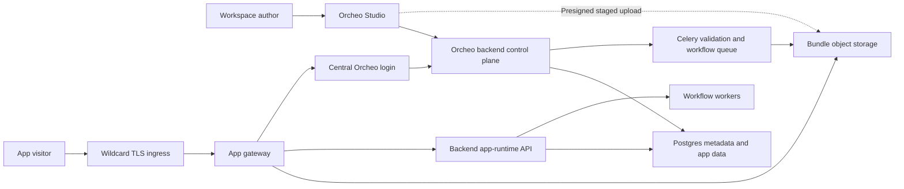

# Design Document

## For Orcheo Hosted Apps

- **Version:** 0.1
- **Author:** Codex
- **Date:** 2026-07-23
- **Status:** Draft

---

## Overview

Orcheo Hosted Apps lets a workspace upload an already-built static web application, bind named frontend operations to workspace-owned workflows, optionally use app-scoped persistent documents, and publish an immutable release at `https://<alias>.<apps-base-domain>`. A release atomically pairs one validated deployment with one approved capability snapshot and immutable executable revisions for its workflow bindings. The hosted beta base domain is `beta.orcheo.cloud`, while self-hosted deployments configure their own base domain.

The design keeps one Orcheo product and policy authority but separates two operational planes. The existing backend and Studio form the control plane: they own apps, aliases, deployments, bindings, permissions, identity integration, quotas, and audit. A new app gateway is the delivery data plane: it resolves wildcard hosts, serves untrusted static assets from object storage, creates host-bound app sessions through the existing identity service, and proxies a narrow same-origin runtime API.

Uploaded bundles are never built or executed on the server. User-authored JavaScript is nevertheless considered untrusted relative to the Orcheo control plane and other workspace resources. It receives no general Orcheo bearer token, workspace header, vault credential, database credential, or arbitrary API proxy. Its authority is limited to the active release's approved workflow and app-data capabilities, re-evaluated by the backend on every runtime operation. In P0, authenticated app visitors must be current members of the publisher workspace; external-customer identity is deferred.

## Architecture



Trust boundaries:

1. Studio and the authenticated `/api/apps` surface are trusted control-plane origins.
2. Every app alias is an untrusted browser origin.
3. The app gateway is trusted infrastructure, but it has only internal app-runtime scopes.
4. Uploaded bundle content and all browser-supplied headers, identifiers, and payloads are untrusted.
5. The backend remains the sole policy authority for app, workspace, session, binding, data, and workflow access.

## Components

- **Hosted Apps Domain (`src/orcheo/hosted_apps/`)**
  - Defines app, alias, staged upload, deployment, immutable release, draft binding, collection, moderation block, session, runtime-run, idempotency, and dispatch-outbox models.
  - Defines repository, bundle-store, release-publication, and runtime authorization protocols.
  - Contains normalization and validation that can be reused by backend, workers, and tests without importing a web framework.

- **Hosted Apps Control Plane (`apps/backend/src/orcheo_backend/app/hosted_apps/`)**
  - Implements lifecycle services for apps, aliases, uploads, deployments, immutable releases, draft bindings, app data, authorization codes, sessions, and moderation blocks.
  - Enforces workspace roles and quotas.
  - Commits mutation audit events in the same transaction or through a transactional outbox.
  - Owns internal app-runtime authorization and output projection against the active release snapshot.

- **Apps Routers (`apps/backend/src/orcheo_backend/app/routers/apps.py`)**
  - Exposes protected Studio/SDK endpoints under `/api/apps`.
  - Uses the existing `authenticate_request` and `resolve_workspace_context` dependency chain.
  - Requires editor role for draft authoring and admin role for grants, visibility, publishing, suspension, and alias changes.

- **Internal App Runtime Router (`apps/backend/src/orcheo_backend/app/routers/app_runtime.py`)**
  - Exposes non-public, service-authenticated contracts used only by app gateway.
  - Is mounted outside the client-selected `/api` workspace lane, excluded from public OpenAPI, and reserved from Studio SPA fallback.
  - Resolves the app from a canonical host rather than trusting app/workspace identifiers from the browser.
  - Exchanges authorization codes, introspects app sessions, authorizes data access, creates workflow runs, and returns projected results.
  - Does not reuse the general protected router's client-selected `X-Orcheo-Workspace` resolution path.

- **App Gateway (`apps/app_gateway/`)**
  - Runs as a separately scalable ASGI service in the Orcheo stack.
  - Accepts only configured wildcard app hosts.
  - Resolves app runtime descriptors through the internal backend contract and caches them briefly.
  - Serves immutable assets from the bundle store.
  - Owns `/__orcheo/auth/*` browser redirects and callbacks.
  - Proxies `/__orcheo/config`, `/__orcheo/workflows/*`, `/__orcheo/runs/*`, and `/__orcheo/data/*` to the internal backend runtime.
  - Strips client attempts to provide internal headers, `Authorization`, `X-Orcheo-Workspace`, gateway assertions, or service identity.
  - Accepts forwarding metadata only from a configured trusted ingress/CDN chain, derives one normalized client address, and sends it to the backend in a gateway-authenticated assertion.
  - Applies the release CSP, forbids service workers, and emits same-origin/no-store policies on private and runtime responses.

- **Bundle Validation Worker (`apps/backend/src/orcheo_backend/worker/`)**
  - Uses a dedicated Celery queue and separately deployed validation-worker consumer with bounded concurrency and resources.
  - Checks archive and file constraints without executing contents.
  - Extracts accepted files to an immutable bundle-store prefix.
  - Creates a server-generated asset manifest containing paths, sizes, digests, MIME types, and validator-derived inline-script hashes for supported HTML.

- **Bundle Store**
  - Protocol supports upload staging, immutable deployment writes, reads, listing for validation, and deletion by deployment prefix.
  - S3-compatible storage is the production implementation and supports S3, R2, and MinIO.
  - A filesystem implementation is limited to local development or documented single-node use.
  - The store never grants browser-visible bucket credentials or authoritative raw object keys.

- **Identity Extension (`src/orcheo/identity/`, backend identity service)**
  - Adds single-use app authorization codes and app sessions.
  - Reuses the existing first-party user and workspace membership.
  - Stores only hashes of raw authorization codes and session secrets.
  - Does not mint a Studio access or refresh token into an app origin.
  - Requires current publisher-workspace membership for every P0 app session and documents configurable absolute and idle expiry.

- **Workflow Runtime**
  - Creates app-originated runs through a dedicated service, not the general workflow-run CRUD route.
  - Binds each release to an immutable digest covering workflow graph plus a copied
    runnable-configuration snapshot; a mutable workflow-version UUID alone is not
    authoritative.
  - Attaches trusted app, deployment, binding, visitor, and workspace metadata to the execution context.
  - Uses distributed quota leases and accounts for existing workspace concurrency/governance limits without falling back to process-local enforcement for anonymous traffic.
  - Atomically stores a separate opaque app-run handle, idempotency record, quota reservation, and dispatch-outbox row with the internal workflow run.

- **App Data Service**
  - Provides JSON document CRUD and cursor pagination.
  - Enforces shared or end-user scoping from the server-side collection definition.
  - Uses stable collection identifiers and JSONB records in Postgres for P0; no arbitrary SQL or joins are exposed.

- **Studio Apps Feature (`apps/studio/src/features/apps/`)**
  - Adds app list/detail, deployment upload/history, bindings, data collections, access, publish review, and health screens.
  - Uses the existing selected-workspace header and authenticated API client.

- **Ingress and Stack (`deploy/stack/`)**
  - Routes the configured Studio/API host as it does today.
  - Adds a wildcard app-host block that routes to app gateway.
  - Provides an optional `hosted-apps` profile and configuration validation.
  - Defines the trusted-proxy hop count or CIDR allowlist used for client-IP derivation.

## Request Flows

### Flow 1: Create an app and reserve an alias

1. An editor opens Studio's Apps page in a selected workspace.
2. Studio submits the name and requested alias to `POST /api/apps`.
3. The backend normalizes the alias, checks the reserved-name policy, and attempts an insert under the global unique constraint.
4. On success, the backend creates a draft app and alias record and emits `hosted_app.created`.
5. Studio opens the app detail page. The alias does not serve content until a valid deployment is published.

### Flow 2: Upload and validate a deployment

1. An editor chooses a prebuilt ZIP in Studio.
2. Studio sends filename, byte size, and optional client digest to `POST /api/apps/{app_id}/uploads`.
3. The backend atomically reserves upload quota and creates a short-lived staged-upload record containing expected size/checksum, expiry, private staging key, and one-time completion state.
4. The client uploads through the returned provider-neutral contract:
   - production may return a presigned object upload whose signed conditions constrain provider-supported size/checksum metadata;
   - local filesystem mode may return a backend multipart endpoint.
5. Studio calls the completion endpoint. The backend reads authoritative object metadata, rejects a size/checksum mismatch, and consumes the upload exactly once.
6. In one transaction the backend marks the deployment `validating`, settles the upload reservation, and writes an idempotent validation outbox record.
7. The worker streams the archive, applies compressed and expanded limits, rejects traversal/symlinks/special files/nested archives, verifies `index.html`, derives MIME types, hashes every accepted file, and writes immutable extracted objects.
8. Files are written idempotently under a unique final deployment prefix. The worker writes and verifies the server-generated manifest last, then transactionally marks the deployment `ready`; S3 prefix rename is not assumed. On failure it records a sanitized error and schedules partial-output cleanup.
9. Studio polls or receives deployment-status updates.

### Flow 3: Configure a workflow binding

1. An admin selects a workflow and executable revision in the same workspace. The backend
   copies the current runnable configuration, computes the graph checksum, and derives an
   immutable digest over both. A client-provided expected digest is only a compare-and-swap
   guard; the server is authoritative.
2. The admin assigns a logical name such as `generate-report`, selects anonymous or authenticated access, defines JSON input schema, output projection, and limits.
3. The backend verifies workspace ownership, workflow/version state, binding-name uniqueness, and governance constraints.
4. The backend persists the binding in the app's mutable draft capability revision and emits `hosted_app.binding_updated`.
5. Expanding a binding's access or output projection creates a new draft capability revision. It does not affect the active release and requires another admin publish confirmation. Reductions and emergency revocations may additionally block the corresponding active capability immediately.

### Flow 4: Publish or roll back

1. An admin opens the publish review.
2. Studio shows bundle digest, deployment creation actor, draft capability revision, visibility, immutable workflow-execution digests, anonymous permissions, data collections, validator-derived CSP hashes/external origins, and quotas.
3. Studio posts the chosen ready deployment to the publish endpoint.
4. Under an app-row lock or compare-and-swap, one database transaction validates every dependency, creates an immutable release snapshot, updates `active_release_id`, changes `publication_state` to `published`, and commits the audit/outbox events. The release contains the selected deployment, acknowledged capability revision, visibility, CSP, bindings, collections, limits, and executable digests.
5. The backend invalidates the app runtime descriptor cache through Redis pub/sub or a cache-generation counter.
6. New gateway resolutions use the new release. Immutable prior objects and release snapshots remain available only for a future rollback and are no longer selected.
7. Rollback creates a new audited release from an older ready deployment and an explicitly reviewed capability snapshot; it never silently combines old code with today's mutable draft grants.

### Flow 5: Serve a public app

1. A visitor opens `https://example.beta.orcheo.cloud/dashboard`.
2. Wildcard ingress sends the request to app gateway with the original host.
3. Gateway validates that the host is exactly one label below the configured base domain.
4. Gateway resolves `example.beta.orcheo.cloud` through its descriptor cache or the backend internal resolver.
5. If the app is published and the active release is public, gateway maps the normalized path to an object in the release's deployment manifest.
6. A real asset is streamed with its server-derived content type. Original alias paths revalidate; only a platform-generated URL containing a verified deployment/content digest may receive a long-lived immutable policy.
7. A non-asset, non-reserved SPA path serves `index.html` with revalidation cache policy and the release-specific CSP, including validator-derived inline-script hashes and mandatory `worker-src 'none'`.
8. Unknown, unpublished, archived, or suspended aliases receive a generic platform response that does not reveal private workspace details.

### Flow 6: Authenticate a private app or optional public-app feature

1. Gateway receives a private app request without a valid `__Host-orcheo_app_session` cookie, or a public app visitor explicitly calls `GET /__orcheo/auth/start?return_to=<safe-relative-path>`.
2. Gateway creates a random state value and PKCE verifier/challenge. It stores the verifier, state hash, canonical app host, safe relative return path, and expiry in a short-lived server-side transaction store. A separate random transaction secret is written as the host-only `__Host-orcheo_app_login` cookie with `HttpOnly`, `Secure`, `SameSite=Lax`, and `Path=/`.
3. Gateway redirects to:

   ```text
   <ORCHEO_APPS_STUDIO_AUTHORIZE_URL>
     ?app_id=<resolved-app-uuid>
     &app_host=<canonical-host>
     &state=<random-state>
     &code_challenge=<base64url-sha256>
     &code_challenge_method=S256
   ```

   These parameters are untrusted hints; the backend re-resolves the current alias, derives the only callback, and requires exact host/app consistency.
4. Studio authenticates the visitor through the existing first-party email flow if no current Studio session exists.
5. Studio calls `POST /api/apps/{app_id}/authorizations` with its bearer token, app host, state, and PKCE challenge. No caller-selected redirect URI is accepted.
6. Backend verifies the app is active, derives the exact current alias callback, checks host/app consistency, and requires the user to be a current member of the publisher workspace.
7. Backend creates a hashed, single-use authorization code with a five-minute TTL and returns an exact redirect URL.
8. Browser returns to `https://example.beta.orcheo.cloud/__orcheo/auth/callback?code=...&state=...`.
9. Gateway loads the login transaction through the HttpOnly transaction secret, verifies state and host, and exchanges the code and server-held PKCE verifier through the internal backend endpoint.
10. Backend atomically consumes the code, rechecks app/workspace/membership and active-release status, creates a hashed app session, and returns the raw session secret once.
11. Gateway writes the raw secret only to a host-only, `HttpOnly`, `Secure`, `SameSite=Lax`, `Path=/`, `__Host-` cookie and redirects to the original safe relative path. The default session lifetime is 12 hours absolute and 30 minutes idle, both configurable.
12. `POST /__orcheo/auth/logout` revokes the app session and clears both app cookies.
13. Publisher-controlled browser code never receives the Studio bearer token, refresh
    token, authorization code, PKCE verifier, or app-session secret; P0 blocks service
    worker registration entirely.

### Flow 7: Invoke a workflow binding

1. App JavaScript posts JSON to `/__orcheo/workflows/generate-report/runs`.
2. Gateway requires exact `Origin`, strict JSON content type, a valid `Idempotency-Key`, and Fetch Metadata/CSRF checks as applicable. It applies request-size limits and proxies with its service identity, canonical host, and normalized trusted client-IP assertion.
3. Backend resolves the active release and immutable binding snapshot from the host and logical name.
4. Backend validates session requirements, graph checksum/executable digest, JSON schema,
   distributed rate/concurrency limits, workspace status, and the release grant. It places
   the release's runnable-configuration snapshot on the run explicitly; the worker may not
   fall back to the mutable workflow-version configuration for an app-originated run.
5. One transaction creates the internal workflow run, opaque app-run mapping, idempotency record, quota lease, and dispatch-outbox row. An outbox dispatcher notifies Celery after commit.
6. Browser receives `202 Accepted` with only the opaque app-run handle and status URL.
7. Browser polls `/__orcheo/runs/{handle}`.
8. Backend verifies that the handle belongs to the current release/app and, for authenticated runs, the originating current app session/user. Anonymous handles are short-lived high-entropy bearer capabilities.
9. Pending/running status is returned without internal trace details.
10. On completion, backend applies the binding's output projection and returns only the approved result or a sanitized error.

### Flow 8: Use app data

1. App JavaScript calls `/__orcheo/data/preferences/current`.
2. Backend resolves the active release from host and the declared `preferences` collection snapshot with its stable collection id.
3. Backend enforces the collection's read or write access. For a `user` collection, it requires a valid app session and derives `owner_subject` from it. For a `shared` collection, it uses the empty shared-owner key; anonymous access is allowed only when explicitly configured.
4. Backend adds authoritative `workspace_id`, `app_id`, collection, and owner scope.
5. Reads/writes use the app-data quota, cursor, and optimistic version rules.
6. Response returns document key, JSON value, version, and timestamps, never storage or tenancy columns.

### Flow 9: Unpublish or suspend

1. A workspace admin unpublishes, or an operator suspends, an app.
2. Backend changes authoritative state or moderation block, revokes outstanding login transactions, authorization codes, and app sessions, rejects new invocations, increments the global/app runtime generation, and invalidates gateway descriptors.
3. Gateway stops selecting bundle content within the invalidation SLO.
4. Existing workflow runs may finish unless the operator explicitly cancels them under existing governance rules, but no new app runtime access is accepted.
5. Immutable deployment objects remain retained according to policy for audit/rollback unless operator deletion is required.

Global disable follows the same path across every app: control-plane mutations fail closed, descriptor resolution and runtime authorization reject, all login transactions/codes/sessions are revoked, and the gateway discards cached descriptors. The 60-second SLO covers gateway resolution, new navigations, login, and runtime access; already downloaded public bytes cannot be recalled.

## API Contracts

All control-plane routes require the existing bearer authentication and
`X-Orcheo-Workspace` header when workspace selection is ambiguous. The central
authorization endpoint is the exception: it derives workspace from the resolved
app/host pair and then verifies the authenticated user's current membership, so an
external redirect never depends on Studio's previously selected workspace.

### Create an app

```http
POST /api/apps
Authorization: Bearer <studio-access-token>
X-Orcheo-Workspace: <workspace-slug>
Content-Type: application/json

{
  "name": "Research Portal",
  "alias": "research-portal",
  "description": "Workspace research application"
}
```

Responses:

```text
201 Created -> HostedAppResponse
400 -> invalid or reserved alias
403 -> editor role required
409 -> alias already reserved or tombstoned
409 -> standing workspace app quota reached
```

### List and inspect apps

```text
GET /api/apps
GET /api/apps/{app_id}
GET /api/apps/{app_id}/deployments
GET /api/apps/{app_id}/deployments/{deployment_id}
GET /api/apps/{app_id}/releases
GET /api/apps/{app_id}/releases/{release_id}
```

List endpoints use cursor pagination once the workspace can contain more than the configured page threshold.

### Update an app

```http
PATCH /api/apps/{app_id}
Authorization: Bearer <studio-access-token>
X-Orcheo-Workspace: <workspace-slug>

{
  "name": "Research Portal",
  "description": "Updated description",
  "visibility": "private",
  "external_origins": []
}
```

Changing `visibility`, alias, external origins, or runtime permissions requires admin role.
Except for emergency reductions, these fields update the draft capability revision only.
They do not alter the active release until a publish transaction acknowledges that exact
revision. Alias changes additionally require explicit release/session handling and cannot
silently move an active private session to another host.

### Start and complete an upload

```http
POST /api/apps/{app_id}/uploads

{
  "filename": "dist.zip",
  "size_bytes": 1842093,
  "sha256": "optional-client-digest"
}
```

```json
{
  "upload_id": "upl_...",
  "deployment_id": "dep_...",
  "method": "PUT",
  "url": "provider-specific-short-lived-url",
  "headers": {},
  "expires_at": "2026-07-23T12:10:00Z",
  "expected_size_bytes": 1842093,
  "required_checksum": "sha256:..."
}
```

```http
POST /api/apps/{app_id}/uploads/{upload_id}/complete

{
  "size_bytes": 1842093,
  "sha256": "final-upload-digest"
}
```

Completion returns `202 Accepted` with deployment status `validating`.

### Configure a workflow binding

```http
PUT /api/apps/{app_id}/bindings/generate-report

{
  "workflow_id": "uuid",
  "workflow_version_id": "uuid",
  "expected_workflow_execution_sha256": "optional-compare-and-swap-digest",
  "access_mode": "authenticated",
  "input_schema": {
    "type": "object",
    "required": ["topic"],
    "properties": {
      "topic": {"type": "string", "maxLength": 500}
    },
    "additionalProperties": false
  },
  "output_projection": {
    "fields": ["report_id", "summary", "status"]
  },
  "visitor_can_read_output": true,
  "visitor_can_read_sanitized_errors": true,
  "limits": {
    "requests_per_minute_per_ip": 10,
    "requests_per_minute_per_session": 20,
    "requests_per_minute_per_app": 100,
    "max_concurrency": 5,
    "timeout_seconds": 300,
    "max_input_bytes": 32768,
    "max_output_bytes": 262144
  }
}
```

`output_projection` is a documented allowlist DSL over JSON objects; missing fields are
omitted, arrays are bounded, and the projected encoded response must fit
`max_output_bytes`. `timeout_seconds` applies to worker execution and result visibility,
using a cooperative cancellation request followed by a configured hard worker limit.

Responses:

```text
200 OK -> HostedAppBindingResponse
400 -> invalid name/schema/projection/limits
403 -> admin role required
404 -> app or workflow/version not found in workspace
409 -> archived parent workflow, executable-digest mismatch, or stale app state
```

### Configure an app-data collection

```http
PUT /api/apps/{app_id}/collections/preferences

{
  "scope": "user",
  "read_access": "authenticated",
  "write_access": "authenticated",
  "max_document_bytes": 32768,
  "max_records": 1000
}
```

Collection names use the same normalized logical-name rules as bindings. P0 does not accept arbitrary indexes or query definitions.

### Publish, unpublish, roll back, and archive

```http
POST /api/apps/{app_id}/deployments/{deployment_id}/publish

{
  "acknowledged_permission_revision": 7
}
```

```text
POST /api/apps/{app_id}/unpublish
POST /api/apps/{app_id}/deployments/{prior_deployment_id}/publish
POST /api/apps/{app_id}/archive
POST /api/apps/{app_id}/restore
```

Publish returns the canonical URL and active immutable release plus its deployment:

```json
{
  "app_id": "uuid",
  "state": "published",
  "active_release_id": "uuid",
  "active_deployment_id": "uuid",
  "published_permission_revision": 7,
  "url": "https://research-portal.beta.orcheo.cloud"
}
```

### Platform moderation and global runtime controls

These routes are mounted outside selected-workspace routing and reject ordinary user
tokens, workspace owner/admin roles, and the gateway identity:

```text
POST /api/platform/hosted-apps/moderation-blocks
POST /api/platform/hosted-apps/moderation-blocks/{block_id}/lift
GET  /api/platform/hosted-apps/ownership?target_kind=<kind>&target_id=<id>
POST /api/platform/hosted-apps/runtime/disable
POST /api/platform/hosted-apps/runtime/enable
```

Moderation mutations require `platform:hosted-apps:moderate`; global runtime changes
require the narrower high-impact `platform:hosted-apps:runtime-control` scope and stronger
operator authentication. Requests include a stable reason code, restricted detail, and
idempotency key. The mutation, runtime generation, and platform audit/outbox event commit
atomically. Enable does not republish, restore, or lift moderation blocks.

### Create an app authorization code

This route is called by trusted Studio UI after central authentication:

```http
POST /api/apps/{app_id}/authorizations
Authorization: Bearer <studio-access-token>

{
  "app_host": "research-portal.beta.orcheo.cloud",
  "state": "random-browser-state",
  "code_challenge": "base64url-sha256",
  "code_challenge_method": "S256"
}
```

The server derives the only permitted callback from the current alias and requires
`app_host` to equal that canonical host. It never accepts a caller-selected redirect URL.

```json
{
  "redirect_to": "https://research-portal.beta.orcheo.cloud/__orcheo/auth/callback?code=one-time-code&state=random-browser-state"
}
```

### Browser authentication routes

```text
GET  /__orcheo/auth/start?return_to=<urlencoded-safe-relative-path>
GET  /__orcheo/auth/callback?code=<one-time-code>&state=<state>
GET  /__orcheo/auth/session
POST /__orcheo/auth/logout
```

`auth/start` is available to private apps through automatic navigation and to public apps
through explicit visitor action. `return_to` must begin with `/`, must not contain a
scheme/authority/backslash/control character, and is stored only in the server-side login
transaction. Callback consumes that transaction and redirects without leaving code/state
in the final URL. Session/logout responses are same-origin and `private, no-store`; logout
requires exact Origin and CSRF validation.

### Browser runtime configuration

```http
GET /__orcheo/config
Host: research-portal.beta.orcheo.cloud
```

```json
{
  "app": {
    "name": "Research Portal",
    "alias": "research-portal",
    "release_id": "uuid",
    "deployment_id": "uuid",
    "permission_revision": 7,
    "visibility": "public"
  },
  "session": {
    "authenticated": false,
    "user": null
  },
  "bindings": {
    "generate-report": {"access_mode": "authenticated"}
  },
  "collections": {
    "preferences": {
      "scope": "user",
      "read_access": "authenticated",
      "write_access": "authenticated"
    }
  },
  "html_policy": {
    "index.html": {
      "inline_script_sha256": ["sha256-..."],
      "contains_inline_event_handlers": false
    }
  }
}
```

No workspace id, workflow id, storage key, token, or internal service URL is returned.
For an authenticated session, `session.user` contains only the minimum display fields
approved for app use; it never exposes membership lists or Studio authorization data.
This response is `Cache-Control: private, no-store` and
`Cross-Origin-Resource-Policy: same-origin`.

### Browser workflow runtime

```http
POST /__orcheo/workflows/generate-report/runs
Host: research-portal.beta.orcheo.cloud
Origin: https://research-portal.beta.orcheo.cloud
Content-Type: application/json
Idempotency-Key: random-client-operation-id

{
  "input": {"topic": "workflow orchestration"}
}
```

The idempotency key is scoped to app, release, binding, and originating session/anonymous
client bucket. Reuse with the same canonical request returns the existing handle; reuse
with a different request hash returns `409 Conflict`. Records expire after a configurable
minimum of 24 hours.

```json
{
  "id": "arun_opaque_random",
  "status": "queued",
  "status_url": "/__orcheo/runs/arun_opaque_random"
}
```

```http
GET /__orcheo/runs/arun_opaque_random
```

```json
{
  "id": "arun_opaque_random",
  "status": "succeeded",
  "output": {
    "report_id": "rpt_123",
    "summary": "Projected binding output",
    "status": "ready"
  }
}
```

### Browser app-data runtime

```text
POST   /__orcheo/data/{collection}
GET    /__orcheo/data/{collection}?cursor=<opaque>&limit=50
GET    /__orcheo/data/{collection}/{key}
PUT    /__orcheo/data/{collection}/{key}
DELETE /__orcheo/data/{collection}/{key}
```

Create/update request:

```json
{
  "key": "current",
  "value": {"theme": "dark"},
  "expected_version": 3
}
```

Response:

```json
{
  "key": "current",
  "value": {"theme": "dark"},
  "version": 4,
  "created_at": "2026-07-23T12:00:00Z",
  "updated_at": "2026-07-23T12:05:00Z"
}
```

`expected_version` is omitted for create. A stale update returns `409 Conflict`.
All app-data and run responses use `Cache-Control: private, no-store`,
`Cross-Origin-Resource-Policy: same-origin`, and `Vary: Cookie, Origin` where applicable.

### Internal gateway contracts

Internal routes are excluded from public OpenAPI and reject ordinary user/service tokens. App gateway authenticates using a dedicated service identity restricted to app-runtime scopes.

```text
GET  /internal/apps/resolve?host=<canonical-host>
POST /internal/apps/auth/exchange
POST /internal/apps/sessions/introspect
POST /internal/apps/workflows/{binding}/runs
GET  /internal/apps/runs/{handle}
POST /internal/apps/data/{collection}
GET  /internal/apps/data/{collection}
GET  /internal/apps/data/{collection}/{key}
PUT  /internal/apps/data/{collection}/{key}
DELETE /internal/apps/data/{collection}/{key}
```

Rules:

- Backend independently normalizes and resolves `host`.
- Gateway removes all browser `Authorization`, `Cookie` names other than the app-session cookie, `X-Orcheo-*`, `Forwarded`, and gateway-identity headers before constructing the internal request.
- Gateway accepts forwarding metadata only from configured trusted proxy addresses/hops,
  canonicalizes one client IP or privacy-preserving prefix, and places it in a dedicated
  internal assertion that is accepted only after gateway authentication. Direct or
  browser-supplied assertions are rejected.
- Internal service identity cannot call general workflow or vault routes.
- Runtime authorization always loads the active immutable release snapshot plus any
  stricter emergency revocation; mutable draft policy and gateway cache are not
  authorization authorities.

## Data Models / Schemas

### `hosted_apps`

| Field | Type | Description |
|-------|------|-------------|
| id | UUID primary key | App identifier |
| workspace_id | UUID not null | Owning workspace |
| name | text not null | Display name |
| description | text null | Publisher description |
| visibility | text not null | Draft `public` or `private`; the active value comes from the release snapshot |
| publication_state | text not null | `draft`, `published`, or `unpublished` |
| is_archived | boolean not null | Archive lifecycle overlay |
| active_release_id | UUID null | Currently promoted immutable release |
| permission_revision | bigint not null | Incremented when bindings, data permissions, visibility, or external origins change |
| published_permission_revision | bigint null | Revision acknowledged by the active/latest release |
| external_origins | JSONB not null | Draft validated CSP additions; active values come from the release |
| suspended_at | timestamptz null | Suspension overlay; takes precedence over publication state |
| suspended_reason | text null | Workspace-admin suspension reason, access-controlled |
| suspended_by | text null | Authenticated workspace admin subject |
| suspension_kind | text null | Workspace-owned suspension; platform moderation is stored separately |
| created_by | text not null | Authenticated subject |
| created_at | timestamptz not null | Creation time |
| updated_at | timestamptz not null | Last mutation |
| published_at | timestamptz null | Latest publish time |
| archived_at | timestamptz null | Archive time |

Indexes:

- `(workspace_id, is_archived, publication_state, updated_at DESC)`
- `(workspace_id, id)`
- partial index on published apps where `publication_state = 'published' AND is_archived = FALSE AND suspended_at IS NULL`

API responses may expose a single derived `state` for display. Resolution always evaluates
global disable and platform moderation first, then workspace suspension, archive state,
and publication state, so reinstating a suspended app does not lose its prior publication
lifecycle.

### `hosted_app_aliases`

| Field | Type | Description |
|-------|------|-------------|
| alias | citext/text primary key | Globally unique normalized DNS label |
| app_id | UUID null | Current app owner; null while tombstoned |
| workspace_id | UUID null | Owning workspace while active |
| reserved_kind | text not null | `app`, `platform`, or `tombstone` |
| tombstoned_until | timestamptz null | Earliest permitted reuse |
| created_at | timestamptz not null | Reservation time |
| updated_at | timestamptz not null | Last lifecycle change |

Application normalization remains mandatory even if `citext` is used. A database unique constraint is the final conflict authority.
Add a partial unique constraint on `app_id` where `app_id IS NOT NULL` so one app cannot own multiple active platform aliases in P0.

Alias changes are transactional: the old row becomes a tombstone and the new row is
reserved before publication moves. P0 retains an app's alias while archived. A released
or tombstoned alias does not carry app sessions, release descriptors, storage scope, or
browser execution state to a future owner.

### `hosted_app_uploads`

| Field | Type | Description |
|-------|------|-------------|
| id | UUID primary key | Public `upload_id` |
| deployment_id | UUID unique not null | Candidate deployment |
| app_id | UUID not null | Parent app |
| workspace_id | UUID not null | Owning workspace |
| status | text not null | `pending`, `completed`, `expired`, or `failed` |
| staging_key | text not null | Random private object key |
| provider_object_version | text null | Authoritative provider version/ETag where available |
| expected_size_bytes | bigint not null | Quota-reserved declared size |
| expected_sha256 | text null | Signed/declared checksum |
| actual_size_bytes | bigint null | Server-read object metadata |
| actual_sha256 | text null | Validator-computed archive digest |
| expires_at | timestamptz not null | Completion deadline |
| completed_at | timestamptz null | Atomic one-time completion marker |
| created_by | text not null | Authenticated subject |
| created_at | timestamptz not null | Creation time |

Completion performs a conditional `pending -> completed` transition. Expired or
mismatched uploads release reservations and enter cleanup; provider object keys never
reach ordinary app metadata or browser runtime responses.

### `hosted_app_deployments`

| Field | Type | Description |
|-------|------|-------------|
| id | UUID primary key | Deployment identifier |
| app_id | UUID not null | Parent app |
| workspace_id | UUID not null | Denormalized scope |
| status | text not null | `uploading`, `validating`, `ready`, `failed`, `deleted` |
| upload_id | UUID null | Staged-upload record used to create this candidate |
| bundle_prefix | text null | Private immutable extracted prefix |
| manifest_key | text null | Private generated manifest key |
| bundle_sha256 | text null | Digest of submitted archive |
| manifest_sha256 | text null | Digest of generated asset manifest |
| compressed_bytes | bigint null | Authoritative uploaded archive size after completion |
| expanded_bytes | bigint null | Accepted extracted size |
| file_count | integer null | Accepted file count |
| validation_error_code | text null | Stable safe error code |
| validation_error_message | text null | Sanitized author-facing detail |
| created_by | text not null | Authenticated subject |
| created_at | timestamptz not null | Creation time |
| validated_at | timestamptz null | Validation completion |

Private object keys are never included in browser responses.

### Generated deployment manifest

```json
{
  "version": 1,
  "index": "index.html",
  "files": {
    "index.html": {
      "size_bytes": 2145,
      "sha256": "...",
      "content_type": "text/html; charset=utf-8"
    },
    "assets/main-abc123.js": {
      "size_bytes": 140232,
      "sha256": "...",
      "content_type": "text/javascript; charset=utf-8"
    }
  }
}
```

Paths are normalized relative paths. Manifest content is generated by the validator and is never trusted from the uploaded archive.

The manifest also contains an `html_policy` entry per HTML file with SHA-256 hashes of
supported inline scripts. Unsupported executable constructs fail validation with a stable
error. Bundle entries whose normalized path starts with `__orcheo/` are rejected.

### `hosted_app_releases`

| Field | Type | Description |
|-------|------|-------------|
| id | UUID primary key | Immutable release identifier |
| workspace_id | UUID not null | Owning workspace |
| app_id | UUID not null | Parent app |
| deployment_id | UUID not null | Ready deployment selected for the release |
| permission_revision | bigint not null | Exact acknowledged draft revision |
| visibility | text not null | Published `public` or `private` value |
| capability_snapshot | JSONB not null | Immutable normalized bindings, collections, limits, and output policies |
| csp_snapshot | JSONB not null | Mandatory directives, inline hashes, and approved external origins |
| snapshot_sha256 | text not null | Digest of canonical release policy |
| created_by | text not null | Publishing admin |
| created_at | timestamptz not null | Publish/rollback time |

Release rows are append-only. The publish transaction locks or compare-and-swaps the app,
verifies the draft revision and all dependency digests, inserts a release and audit/outbox
event, then changes `active_release_id`. Runtime authorization uses only that release plus
stricter emergency revocation. Rollback creates another release rather than mutating an
old snapshot. Index `(app_id, snapshot_sha256)` for lookup; identical snapshots may appear
in multiple audited releases.

### `hosted_app_bindings`

| Field | Type | Description |
|-------|------|-------------|
| id | UUID primary key | Binding identifier |
| app_id | UUID not null | Parent app |
| workspace_id | UUID not null | Owning workspace |
| name | text not null | Logical runtime name, unique within app |
| description | text null | Author-facing description |
| workflow_id | UUID not null | Bound workflow |
| workflow_version_id | UUID not null | Pinned version |
| workflow_execution_sha256 | text not null | Immutable digest over graph and runnable configuration |
| runnable_config_snapshot | JSONB not null | Server-copied configuration used by app-originated runs |
| access_mode | text not null | `anonymous` or `authenticated` |
| input_schema | JSONB not null | Server-enforced JSON Schema subset |
| output_projection | JSONB not null | Allowlisted response projection |
| visitor_can_read_output | boolean not null | Whether projected result output is returned |
| visitor_can_read_sanitized_errors | boolean not null | Whether stable sanitized errors are returned |
| limits | JSONB not null | Binding-specific validated limits |
| created_at | timestamptz not null | Creation time |
| updated_at | timestamptz not null | Last mutation |
| deleted_at | timestamptz null | Draft tombstone; releases retain copied definitions |

Partial unique constraint: `(app_id, name)` where `deleted_at IS NULL`.

Foreign ownership and the executable digest are verified through workspace-scoped workflow
queries and database constraints where possible. Binding changes affect only a draft
revision; release snapshots retain the approved immutable binding definition. A referenced
workflow graph mutation must create a new executable revision. Later in-place runnable
configuration changes do not affect an active release because its copied snapshot is used;
Studio marks affected draft review stale so an admin can deliberately adopt the new
configuration. The existing workflow runnable-config mutation must derive its actor from
authentication, enforce the required workspace role, and emit a dependency-invalidation
event rather than trusting a request-body actor.

### `hosted_app_collections`

| Field | Type | Description |
|-------|------|-------------|
| id | UUID primary key | Collection identifier |
| app_id | UUID not null | Parent app |
| workspace_id | UUID not null | Owning workspace |
| name | text not null | Logical collection name |
| scope | text not null | `shared` or `user` |
| read_access | text not null | `anonymous` or `authenticated` |
| write_access | text not null | `anonymous` or `authenticated` |
| max_document_bytes | integer not null | Per-record cap |
| max_records | integer not null | Collection record cap |
| created_at | timestamptz not null | Creation time |
| updated_at | timestamptz not null | Last mutation |
| deleted_at | timestamptz null | Tombstone time; releases retain copied definitions |

Partial unique constraint: `(app_id, name)` where `deleted_at IS NULL`.

### `hosted_app_records`

| Field | Type | Description |
|-------|------|-------------|
| id | UUID primary key | Internal record id |
| workspace_id | UUID not null | Authoritative tenant scope |
| app_id | UUID not null | Authoritative app scope |
| collection_id | UUID not null | Stable declared collection identifier |
| owner_subject | text not null | Empty string for shared scope, authenticated user id for user scope |
| key | text not null | App-provided normalized key |
| value | JSONB not null | JSON document |
| size_bytes | integer not null | Canonical encoded size for quotas |
| version | bigint not null | Optimistic concurrency version |
| created_at | timestamptz not null | Creation time |
| updated_at | timestamptz not null | Last mutation |

Unique constraint: `(app_id, collection_id, owner_subject, key)`.

All queries include `workspace_id`, `app_id`, `collection_id`, and `owner_subject`.
Client-provided values never populate the first three fields or `owner_subject`. A normal
draft deletion tombstones the definition for future releases but does not mutate an active
release snapshot; an explicit emergency revocation can block it immediately. After no
active release authorizes the tombstoned id, its records become inaccessible. Reusing a
display name creates a new id and cannot resurrect prior records. Cleanup follows the
retention policy.

### `hosted_app_authorization_codes`

| Field | Type | Description |
|-------|------|-------------|
| id | UUID primary key | Internal code identifier |
| code_hash | text unique not null | SHA-256 hash of raw single-use code |
| app_id | UUID not null | Target app |
| workspace_id | UUID not null | Target workspace |
| user_id | UUID not null | Authenticated first-party user |
| redirect_uri | text not null | Exact derived alias callback |
| code_challenge | text not null | PKCE S256 challenge |
| expires_at | timestamptz not null | Short expiry, default 5 minutes |
| consumed_at | timestamptz null | Atomic single-use marker |
| created_at | timestamptz not null | Creation time |

The browser state value is echoed but not used as backend authorization; gateway validates it against its own login transaction.

### `hosted_app_sessions`

| Field | Type | Description |
|-------|------|-------------|
| id | UUID primary key | Session identifier |
| secret_hash | text unique not null | SHA-256 hash of raw cookie secret |
| app_id | UUID not null | Exact app |
| workspace_id | UUID not null | Exact workspace |
| app_host | text not null | Exact canonical alias host at issuance |
| user_id | UUID not null | First-party user |
| created_at | timestamptz not null | Creation time |
| expires_at | timestamptz not null | Absolute expiry |
| idle_expires_at | timestamptz not null | Sliding idle deadline, coarsely refreshed |
| revoked_at | timestamptz null | Revocation time |
| last_seen_at | timestamptz null | Coarsely updated activity |
| user_agent_hash | text null | Optional abuse signal, not hard binding |
| initial_ip_prefix | text null | Optional abuse signal, not hard binding |

Only the initial code exchange returns the raw secret. Introspection uses a hash and
rechecks app/workspace status, current membership, absolute/idle expiry, and runtime
generation. It also requires the request's canonical host to equal `app_host`, so an alias
change cannot carry a session to a new origin. Defaults are 12 hours absolute and 30
minutes idle. Membership revocation,
app lifecycle changes, platform moderation, and global disable revoke matching sessions;
event hooks accelerate revocation while introspection remains the fail-closed authority.

### `hosted_app_runtime_runs`

| Field | Type | Description |
|-------|------|-------------|
| id | UUID primary key | Internal mapping id |
| public_handle | text unique not null | Random opaque `arun_...` handle |
| workspace_id | UUID not null | Owning workspace |
| app_id | UUID not null | Origin app |
| release_id | UUID not null | Active immutable release at invocation |
| deployment_id | UUID not null | Active deployment at invocation |
| binding_id | UUID not null | Authorized binding |
| binding_snapshot_sha256 | text not null | Exact approved binding snapshot |
| workflow_run_id | UUID not null | Internal workflow run |
| visitor_user_id | UUID null | Authenticated visitor when required |
| originating_session_id | UUID null | Session required to read authenticated results |
| idempotency_key_hash | text not null | Scoped operation id hash |
| created_at | timestamptz not null | Invocation time |
| expires_at | timestamptz not null | Runtime result visibility expiry |

The app runtime never accepts an internal workflow run id from the browser.

### Runtime idempotency and dispatch outbox

`hosted_app_runtime_idempotency` stores the scoped key hash, canonical request hash,
public handle, status, and expiry with a unique constraint over app/release/binding/session
scope. `hosted_app_dispatch_outbox` stores an idempotent event id, workflow run id,
payload reference, attempt count, next attempt time, and delivered time. Run creation,
public mapping, quota lease, idempotency, and outbox insertion share one transaction.
Dispatch is retried independently; workers claim pending runs with an atomic conditional
update before side effects.

### `hosted_app_moderation_blocks`

| Field | Type | Description |
|-------|------|-------------|
| id | UUID primary key | Moderation record |
| target_kind | text not null | `app`, `alias`, `workspace`, or `publisher` |
| target_id | text not null | Canonical target identifier |
| reason_code | text not null | Stable restricted reason |
| reason_detail | text null | Access-controlled operator detail |
| created_by | text not null | Platform moderation principal |
| created_at | timestamptz not null | Block time |
| lifted_by | text null | Platform principal that reinstated |
| lifted_at | timestamptz null | Reinstatement time |

Only identities with explicit global hosted-app moderation scopes may create or lift these
records. Workspace owners/admins cannot do so. Resolution evaluates active blocks before
workspace-owned app state and records every mutation atomically in the platform audit.

`hosted_app_platform_audit_events` stores the authenticated platform principal, action,
target kind/id, reason code, safe metadata, correlation/idempotency key, and timestamp.
It is not owned by a single selected workspace and is access-controlled separately.
Workspace control mutations continue to use `workspace_audit_events`; both paths commit
with their authoritative mutation or transactional outbox rather than best-effort logging.

### Database ownership constraints

Every tenant child table has a composite foreign key through `(workspace_id, app_id)` to
the owning app, plus foreign keys to its stable parent identifiers. Release publication
uses database constraints or transactionally locked checks to prove that the deployment
is ready and belongs to the same app. Workspace hard deletion cascades metadata rows and
writes object/data cleanup work to an outbox before the authoritative workspace row is
removed.

### Workspace quotas

Extend workspace quotas or add hosted-app governance settings:

| Field | Initial intent |
|-------|----------------|
| max_hosted_apps | Maximum non-purged apps, including archived apps so archive cannot evade quota |
| max_app_upload_reservations | Concurrent staged uploads and reserved bytes |
| max_app_deployments | Retained deployments per workspace/app |
| max_app_bundle_bytes | Compressed and expanded deployment limits |
| max_app_storage_bytes | App-record JSON storage |
| max_app_storage_rows | App-record rows |
| max_app_sessions | Active app sessions |
| max_app_invocations_per_minute | Aggregate runtime invocation limit |
| max_app_concurrent_runs | App-originated concurrent runs within existing workspace run quota |

Standing count/byte limits use Postgres transactions with quota reservation rows so an
upload or data write cannot pass a check and then race another replica. Short-window rate
and concurrency limits use Redis Lua/transactions with random lease ids, bounded TTLs, and
idempotent release; they never fall back to process-local counters for anonymous or
cost-bearing operations. Completed work settles reservations, crashed work expires and is
reconciled, and dashboards compare counters with authoritative rows/objects. Redis failure
causes anonymous workflow/data mutations and new sessions to fail closed, while public
static delivery may continue. Per-IP keys use only the gateway-authenticated address or
privacy-preserving prefix derived from the configured trusted-proxy chain.

### Retention and deletion

Hosted beta defaults are configurable but must remain explicit:

| Resource/transition | Initial behavior |
|---------------------|------------------|
| Pending staged upload | Expires after 1 hour; object and reservation reconciled within 24 hours |
| Failed/partial deployment prefix | Unreachable immediately; deleted within 24 hours |
| Ready deployment/release | Active release is never pruned; prior releases obey retained-count/byte quotas and a minimum 30-day rollback window |
| App archive/restore | Alias, releases, deployments, collection definitions, and records are retained and continue counting toward storage quotas; nothing is served while archived |
| Collection delete | Stable id is tombstoned for future releases; active release keeps its copied grant unless emergency-revoked; after no active release grants it, records are inaccessible and deleted after a configurable 30-day recovery window |
| Membership removal | App sessions and user-scoped access are revoked immediately; records remain inaccessible but are retained under app policy until an explicit privacy purge or ordinary retention deletion |
| Authorization code/login transaction | Five-minute/ten-minute TTL respectively, followed by bounded cleanup |
| App session | Twelve-hour absolute and thirty-minute idle default; revoked/expired rows pruned after audit-safe retention |
| Runtime handle/idempotency record | Result access expires after 24 hours by default; idempotency metadata remains at least 24 hours |
| Alias release | Thirty-day tombstone by default; platform moderation may retain a block longer |
| Workspace soft/hard delete | Serving and runtime stop immediately; existing workspace retention applies before hard purge; hard purge cascades metadata and enqueues object/data deletion |
| Backup copies | Deletions age out within the documented backup-retention window, initially 35 days, unless a legal/security hold applies |

Deletion jobs are idempotent and auditable. They never delete the active release or an
object still referenced by a retained release. A reconciliation job compares Postgres
references, object prefixes, quota counters, and cleanup outbox state. Operator takedown
may shorten serving availability immediately while preserving restricted evidence under
the abuse/legal policy.

## Bundle Validation Rules

Initial values are configuration defaults and may be tightened for hosted beta:

| Rule | Initial default |
|------|-----------------|
| Compressed archive size | 50 MiB |
| Expanded deployment size | 250 MiB |
| File count | 5,000 |
| Individual file size | 25 MiB |
| Path depth | 20 segments |
| Required entry | root `index.html` |
| Nested archives | rejected |
| Symlinks/hard links/devices/FIFOs | rejected |
| Absolute/parent traversal paths | rejected |
| Duplicate normalized/case-folded paths | rejected |
| Reserved `__orcheo/` prefix | rejected |
| Unsupported inline executable HTML | rejected |
| Supported inline scripts | SHA-256 hashed into `html_policy` |

The validator streams reads and enforces expanded limits during extraction rather than
trusting ZIP metadata. It writes idempotently to a unique immutable deployment prefix,
writes and verifies the manifest last, and only then changes the database status to
`ready`. S3-compatible implementations never depend on an atomic prefix rename. Partial
prefixes remain unreachable and are deleted by reconciliation after failure.

## Caching and Invalidation

- Gateway runtime descriptor cache key: canonical host.
- Descriptor includes app id, derived state, applicable moderation/runtime generation,
  active immutable release id and digest, release visibility, deployment/manifest digest,
  permission revision, and mandatory security policy.
- Cache TTL must not exceed 30 seconds in hosted beta.
- Publish, unpublish, alias change, archive, suspension, moderation, and global disable
  publish invalidation events. Draft visibility/permission changes do not alter the active
  descriptor.
- `index.html`, original alias asset paths, and `/__orcheo/config` use
  `Cache-Control: no-cache` with ETag in P0.
- Only platform-generated paths containing a verified deployment/content digest may use
  `Cache-Control: public, max-age=31536000, immutable`.
- Private app assets use `Cache-Control: private, no-store` in P0 and must never be stored
  by a shared CDN.
- Auth, config, run, and app-data responses use `Cache-Control: private, no-store`,
  `Cross-Origin-Resource-Policy: same-origin`, and appropriate `Vary` headers.
- Unknown/suspended aliases use short negative caching.
- The backend is authoritative for runtime operations even when the gateway has a cached descriptor.

## Security Considerations

### Origin and cookie isolation

- App content is never served from the Studio/API origin.
- Prefer a distinct registrable user-content domain for production.
- If using `*.beta.orcheo.cloud`, no Orcheo service may rely on a parent-domain auth cookie.
- App session cookies use the `__Host-` prefix, `Secure`, `HttpOnly`, `Path=/`, no `Domain`, and `SameSite=Lax`.
- The login-transaction cookie follows the same constraints and contains only an opaque
  secret for a server-side transaction; publisher JavaScript cannot read PKCE state.
- Each alias receives a separate host-only cookie jar. A cookie for one alias is not valid for another.
- Exact Origin, Fetch Metadata, strict content type, and session-bound CSRF validation
  remain required because sibling subdomains can be same-site even though they are
  different origins. Anonymous mutations receive Origin validation before auth exists.

### Token and internal-service handling

- Studio access and refresh tokens remain confined to the Studio origin.
- Authorization codes and app-session secrets are random, short-lived/revocable, hashed at rest, and never logged.
- Internal gateway credentials are stored only in the gateway runtime and are scoped to app resolution/session/runtime endpoints.
- Gateway-provided host or context headers are accepted only after internal service authentication; backend still normalizes and resolves the host.
- The app gateway cannot use its service identity to call general workflow, credential, token-administration, or workspace-management routes.

### Publisher-code capability model

- Uploaded JavaScript is intentionally executable and may be malicious.
- CSP and origin isolation reduce cross-origin accidents and platform compromise, but do not make publisher code trustworthy.
- An app can disclose any data returned by its grants. Publish review and least-privilege projections are therefore security controls.
- Anonymous workflow grants receive prominent confirmation and conservative limits.
- The active immutable release snapshot, rather than a mutable revision counter alone,
  prevents an already-published approval from silently covering expanded bindings, data
  collections, visibility, or external origins.
- P0 authentication proves current publisher-workspace membership. It is not a general
  customer identity system.

### Mandatory response policy

Baseline headers:

```text
Content-Security-Policy:
  default-src 'self';
  script-src 'self' <validator-derived-sha256-hashes>;
  style-src 'self' 'unsafe-inline';
  img-src 'self' data:;
  font-src 'self' data:;
  connect-src 'self';
  worker-src 'none';
  object-src 'none';
  base-uri 'none';
  form-action 'self';
  frame-ancestors 'none'
X-Content-Type-Options: nosniff
Referrer-Policy: no-referrer
Permissions-Policy: camera=(), microphone=(), geolocation=()
Cross-Origin-Opener-Policy: same-origin
```

Validated external origins may extend only explicitly named fetch/resource directives and
may not remove mandatory directives. `worker-src`, `object-src`, `base-uri`,
`frame-ancestors`, and the no-parent-cookie policy are never publisher-configurable.
Private assets and every reserved runtime response additionally set
`Cross-Origin-Resource-Policy: same-origin`. `Clear-Site-Data` may be used during
operator remediation as defense in depth, but P0 does not rely on it to defeat service
workers because worker registration is prohibited.

### Bundle and path safety

- Normalize URL paths once and compare them only to server-generated manifest paths.
- Reject percent-decoding ambiguity, NUL bytes, backslashes, dot segments, and invalid Unicode normalization.
- Never concatenate a request path directly with a filesystem or object-store root.
- Derive MIME types server-side and send `nosniff`.
- Reserved `/__orcheo/` paths can never be shadowed by bundle files; validation rejects
  that prefix and serving-time lookup independently reserves it.

### App data

- Every query includes authoritative workspace/app/stable-collection/owner scope.
- Cross-scope misses return generic not-found responses.
- Anonymous collection reads or writes require explicit collection grants; anonymous writes use stricter rate and storage limits.
- JSON depth, encoded size, keys, pagination limit, and write rate are bounded.
- No server-side JSONPath, arbitrary SQL expression, or user-defined index is accepted in P0.
- Values are excluded from ordinary logs and audit event details.
- P0 Studio exposes only counts/bytes and safe aggregate health. P1 adds audited
  workspace-admin record inspection/export with privacy and retention controls.

### Workflow runtime

- Bindings pin and verify an immutable graph checksum plus copied runnable-configuration
  snapshot to keep review stable. A mutable workflow-version UUID is metadata, not the
  security boundary, and app-originated workers never fall back to its current config.
- Input schema and byte limits are enforced before creating a run.
- Output projection defaults to no output until configured.
- Result output/error flags and maximum projected bytes are enforced from the release
  snapshot.
- Run acceptance uses scoped idempotency, a transactional outbox, an atomic worker claim,
  and distributed quota leases with expiry/reconciliation. Anonymous traffic fails closed
  when hard cost controls are unavailable.
- Cooperative cancellation and a configured hard task limit enforce binding timeouts.
- Workflow errors are mapped to stable sanitized app errors.
- Credential references, runnable configuration, trace/history, internal node state, and raw exception text are not returned.
- Public invocation does not imply public read access to general workflow or run APIs.

### Abuse and platform operations

- Reserved aliases include platform, security, support, and visually deceptive names.
- Alias mutations, public visibility, anonymous bindings, publish, suspension, and rollback are audited.
- Platform moderation identities with explicit global scopes can block by app id, alias,
  workspace, or publisher account. Workspace roles cannot create or lift those blocks.
- A runtime-generation kill switch is checked by gateway and backend independently and
  revokes login transactions, codes, and sessions when globally disabled.
- A generic interstitial may identify the content as user-published and offer an abuse-report link without placing trusted login controls inside app content.
- Open self-service public publishing remains disabled until takedown ownership and response targets are established.

## Performance Considerations

- Public asset delivery must not consume the primary backend worker pool after descriptor resolution.
- Gateway target for cached host resolution: p95 under 10 ms excluding object-store read.
- Gateway target for uncached descriptor resolution: p95 under 100 ms within the deployment network.
- Static asset throughput is bounded primarily by object store and gateway network capacity; gateway streams rather than buffering entire files.
- Descriptor cache, negative cache, ETags, and platform content-addressed assets reduce backend calls.
- App sessions may be introspected once per short gateway cache window; state-changing runtime operations always reach backend policy.
- App-data lists use cursor pagination and maximum page size 100.
- Deployment validation runs in a dedicated Celery queue consumed by a separate bounded
  validation-worker service so large archives cannot starve workflow execution.
- Per-workspace validation concurrency prevents one tenant from exhausting workers or object-store bandwidth.
- Postgres indexes must cover host/alias resolution, workspace app listing, session secret hashes, public run handles, and scoped app-data lookup.
- Retention jobs remove expired uploads, failed partial deployments, expired authorization codes/sessions/runtime handles, tombstones after policy, and old deployments beyond workspace retention.

## Failure Behavior

| Failure | Behavior |
|---------|----------|
| Unknown alias | Generic 404; no workspace disclosure |
| Unpublished/archived app | Generic unavailable response |
| Suspended app | Operator-controlled unavailable/interstitial response |
| Object store unavailable | 503 with short retry policy; no fallback to another deployment |
| Backend temporarily unavailable | Cached public static assets may continue until descriptor TTL; runtime and uncached/private auth fail closed |
| Cache invalidation missed | TTL bounds stale delivery; runtime policy still rejects revoked operations |
| Validation worker failure | Deployment remains non-publishable and can be retried idempotently |
| Membership removed | Existing app sessions are revoked; introspection fails closed |
| Workflow parent archived or executable digest changed | New invocations fail; publish validation identifies stale binding |
| Temporary rate/concurrency limit | 429 with bounded `Retry-After`; no partial run/data mutation |
| Standing storage/count quota exhausted | 409 or 422 with stable non-retryable quota code; no partial mutation |
| Redis/governance unavailable | Anonymous cost-bearing mutations fail closed; static public delivery may continue |
| Dispatch broker unavailable | Transactional outbox retains the accepted run for retry; idempotent client retries return the same handle |
| Global Hosted Apps disable | Resolution, login, and runtime fail closed; descriptor generation changes and sessions/codes are revoked |

## Testing Strategy

- **Unit tests**
  - Alias normalization, reserved names, tombstones, and unique-conflict mapping.
  - Role checks, immutable release snapshots, draft/live permission separation, and
    publish compare-and-swap behavior.
  - ZIP streaming limits, malformed filename encoding, traversal, absolute paths,
    symlink/hard-link/special-file metadata, nested archives, reserved `__orcheo/`,
    executable formats, duplicate normalized path, and zip-bomb cases.
  - Asset manifest creation, inline-script hashing/rejection, content types, URL
    normalization, and SPA fallback.
  - Authorization-code hashing, server-side login transactions, exact host/callback,
    PKCE validation, expiry, atomic consumption, and replay rejection.
  - App-session hashing, absolute/idle expiry, membership/global-disable revocation,
    exact app/workspace/user scope, and cookie construction.
  - Binding executable-digest validation, JSON schema validation, output/error flags,
    output projection/size, and limit enforcement.
  - App-data shared/user scoping, stable collection identity, delete/recreate behavior,
    optimistic concurrency, quotas, and cursor encoding.

- **Property/fuzz tests**
  - Archive filenames and URL path normalization.
  - Alias generation and case-folded uniqueness.
  - Malformed JSON schemas and deeply nested app documents.
  - Header-smuggling and spoofed trusted-client-IP attempts against gateway context stripping.

- **Integration tests**
  - Create -> upload -> validate -> publish -> resolve -> serve asset.
  - Atomic publish/rollback with immutable capability snapshots and concurrent draft edits.
  - Republish and rollback where multiple deployments reuse the same asset path and bytes differ.
  - Public and private app asset behavior.
  - Studio authorize redirect -> server-side login transaction -> code -> PKCE exchange
    -> host-only app session, including optional login from a public app.
  - Cross-app, cross-alias, cross-workspace, removed-membership, expired-session, and replay denial.
  - Anonymous and authenticated binding invocation through durable outbox dispatch and projected output.
  - Idempotent retry, broker outage recovery, atomic worker claim, quota-lease expiry, and timeout cancellation.
  - App binding cannot invoke a workflow from another workspace or a changed executable digest.
  - App runtime cannot access general `/api`, vault, run history, or arbitrary workflow ids.
  - Shared and user collection CRUD with cross-user denial and no data resurrection after collection-name reuse.
  - S3-compatible bundle store against MinIO in CI or an integration profile.
  - Workspace hard-delete produces metadata cascade and object/data cleanup outbox work.

- **Compose/end-to-end tests**
  - Wildcard Host routing through Caddy to app gateway.
  - Studio/API host remains routed to current services.
  - Real browser private login callback and cookie attributes.
  - Service-worker registration fails and cannot intercept `/__orcheo/auth/*` or runtime paths.
  - SPA route fallback and reserved namespace handling.
  - Publish/suspend propagation under a warm descriptor cache.
  - Platform-operator block and global-disable propagation with Redis available/unavailable.

- **Load and resilience tests**
  - Static asset concurrency does not materially affect backend latency.
  - One workspace cannot monopolize validation workers.
  - App invocation rate and concurrency limits hold under race.
  - Object-store/backend/Redis interruption produces documented fail-closed behavior.
  - A separately subscribed validation worker prevents archive load from consuming workflow-worker capacity.

- **Manual QA checklist**
  - Upload representative Vite and plain HTML builds.
  - Verify browser developer tools never expose Studio or vault credentials.
  - Verify private asset URLs fail without the exact alias session.
  - Review CSP and security headers on HTML, JavaScript, CSS, SVG, and unknown paths.
  - Upload representative inline-script static exports and verify only manifest-approved hashes execute.
  - Exercise operator suspension and abuse-report link.
  - Verify mobile passwordless redirect and return-to behavior.

## Observability

Metrics should be tagged by deployment/environment and use opaque app/workspace ids where safe:

- App create/publish/unpublish/rollback/suspend counts.
- Upload bytes, expanded bytes, file counts, validation latency, failure codes, and orphan cleanup.
- Gateway host-resolution cache hit rate and latency.
- Static response count/bytes/status, object-store latency, and error rate.
- Authorization start/success/failure/replay and session introspection outcomes.
- Workflow invocation acceptance/outbox lag/dispatch attempts, queue/run latency,
  idempotent replay, completion rate, sanitized failure class, quota lease, and rejection.
- App-data rows/bytes/read/write latency and quota rejection.
- Cache invalidation publish/consume lag.
- Global/app runtime generation propagation and active moderation block counts.

Logs must not contain bundle contents, app documents, auth codes, session secrets, workflow input/output, or raw service credentials. Audit events record actor, resource, action, revision, and safe metadata.

## Configuration

Illustrative configuration contract:

```env
ORCHEO_HOSTED_APPS_ENABLED=false
ORCHEO_APPS_BASE_DOMAIN=beta.orcheo.cloud
ORCHEO_APPS_STUDIO_AUTHORIZE_URL=https://studio.orcheo.cloud/apps/authorize
ORCHEO_APP_GATEWAY_INTERNAL_URL=http://app-gateway:2030
ORCHEO_APP_GATEWAY_SERVICE_TOKEN=<secret>
ORCHEO_APP_GATEWAY_TRUSTED_PROXY_CIDRS=
ORCHEO_APP_SESSION_ABSOLUTE_SECONDS=43200
ORCHEO_APP_SESSION_IDLE_SECONDS=1800

ORCHEO_APP_BUNDLE_BACKEND=s3
ORCHEO_APP_BUNDLE_S3_ENDPOINT=
ORCHEO_APP_BUNDLE_S3_REGION=
ORCHEO_APP_BUNDLE_S3_BUCKET=
ORCHEO_APP_BUNDLE_S3_ACCESS_KEY=
ORCHEO_APP_BUNDLE_S3_SECRET_KEY=

ORCHEO_APP_MAX_ARCHIVE_BYTES=52428800
ORCHEO_APP_MAX_EXPANDED_BYTES=262144000
ORCHEO_APP_MAX_FILE_COUNT=5000
ORCHEO_APP_DESCRIPTOR_CACHE_SECONDS=30
ORCHEO_APP_ALIAS_TOMBSTONE_DAYS=30
```

Exact variable naming may consolidate with existing S3/blob and service-token settings. Secrets must use stack secret handling and must not be injected into Studio or bundles.

The runtime generation is durable platform state, not a process environment variable; a
global-disable operation increments it transactionally and publishes invalidation.

### Local development

Static/public development uses `<alias>.apps.localhost`, which resolves to loopback in
supported browsers, plus the filesystem or local MinIO bundle store. Authentication,
`Secure` cookies, callback validation, and sibling-origin tests must run through local
HTTPS using Caddy's local CA or a documented development certificate for
`*.apps.localhost`; the production cookie contract is not weakened for HTTP. The setup
guide includes certificate trust, wildcard-host verification, and a smoke test. A
separate auth-disabled mode may speed UI work but does not count as auth acceptance
testing.

## Migration and Backwards Compatibility

- All tables and routes are additive; there is no existing hosted-app data to migrate.
- Hosted apps remain disabled unless both feature and required infrastructure configuration are valid.
- Existing Studio/API routing, workflow publication, ChatKit publication, identity sessions, and CORS behavior are unchanged.
- App runtime introduces new internal service scopes without broadening existing user or service tokens automatically.
- Schema creation follows existing Postgres repository conventions with explicit idempotent
  migration statements, composite tenant foreign keys, indexes, and an object-cleanup
  reconciliation/outbox path for workspace purge.
- Disabling the feature stops gateway routing and new mutations but does not delete app metadata or bundle objects.

## Rollout Plan

1. Complete a baseline threat model; choose the beta/production domain boundary; define
   platform moderation identity, publisher verification, takedown ownership, and the
   global kill-switch contract.
2. Add domain models, immutable release/upload schema, repository, feature flag/allowlist,
   tenant constraints, audit/outbox infrastructure, and control-plane APIs with no public
   ingress.
3. Add bundle store, dedicated validation worker, validator/CSP hashing, and dogfood
   upload/validation from Studio.
4. Add app gateway, trusted-proxy handling, service-worker prohibition, safe caching, and
   staging wildcard domain for public static apps.
5. Add immutable workflow bindings, durable/idempotent app runtime, distributed limits,
   and internal service identity with Origin checks from the first mutation endpoint.
6. Add the complete central authorize contract, server-side login transactions, private
   app sessions, and session lifecycle revocation.
7. Add stable-identity app-data collections, quotas, and retention behavior.
8. Complete operator moderation, abuse workflow, observability, restore/reconciliation,
   penetration testing, and global-disable drills.
9. Open hosted beta to selected verified workspaces using the measurable go/no-go scorecard.
10. Add the optional self-hosted stack profile after cloud staging is stable.

Rollback:

- Disable `ORCHEO_HOSTED_APPS_ENABLED` and remove wildcard ingress routing.
- Retain Postgres metadata and bundle objects for recovery.
- Revoke all app sessions and authorization codes when globally disabling the runtime.
- No existing workflow, ChatKit, Studio, or identity data requires reversal.

---

## Decision Summary

| Decision | Outcome |
|----------|---------|
| Product boundary | First-class Orcheo workspace resource |
| Deployment boundary | Dedicated app gateway in the same repository/stack |
| Application format | Prebuilt static bundle only |
| Build execution | Never run user build/package commands |
| Identity | Existing first-party identity via authorization-code exchange |
| Browser credentials | Host-only HttpOnly app session; no Studio bearer token |
| Authenticated P0 audience | Current members of the publisher workspace |
| Browser workers | Service workers prohibited by mandatory `worker-src 'none'` |
| Workflow access | Named binding pinned to an immutable graph+runnable-config digest |
| Workflow publication | Independent from app publication |
| Database access | Scoped JSON document API; no raw SQL credentials |
| Release | Immutable deployment plus approved capability/CSP/executable snapshot |
| Assets | Immutable object-store deployments; stable paths revalidate and only verified content-addressed paths cache immutably |
| Initial domain | Configurable; hosted beta uses `*.beta.orcheo.cloud` |
| Preferred production isolation | Separate registrable user-content domain |
| Custom domains | Deferred |
| SSR/server code | Deferred to a separate initiative |

## Revision History

| Date | Author | Changes |
|------|--------|---------|
| 2026-07-23 | Codex | Initial draft |
| 2026-07-23 | Codex | Added immutable release snapshots, service-worker prohibition, safe caching, executable digests, durable runtime dispatch, explicit uploads/moderation, complete auth contracts, trusted proxy handling, and lifecycle guarantees after review |
